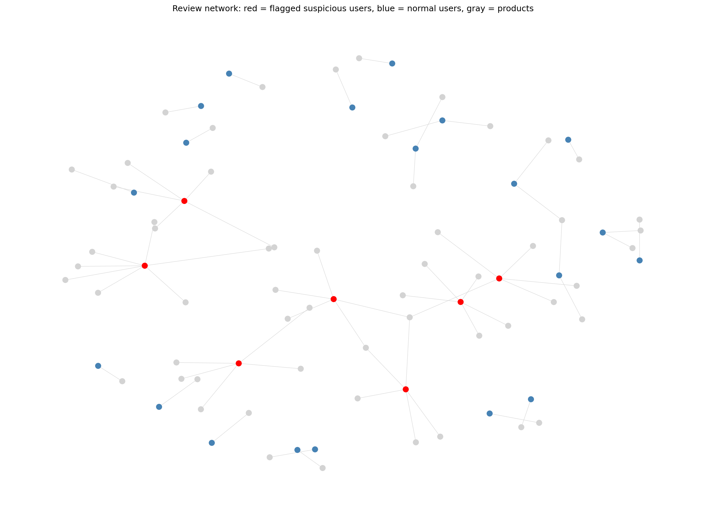

# Graph Review Fraud Detection

A graph neural network that flags suspicious reviewers on the Amazon Fine
Food Reviews dataset by learning from **network structure** — how
reviewers and products connect to each other — rather than review text.
Fake reviewers tend to leave a structural fingerprint (posting bursts,
narrow product targeting) that's invisible in any single review read
alone, but visible once you look at the graph.

## Why graph structure, not just text

Most fake-review detectors classify one review at a time based on its
text. This project instead builds a bipartite reviewer-product graph and
trains a **Graph Convolutional Network (GCN)**, as a graph autoencoder,
to learn a compressed representation of each user's neighborhood. Users
with structurally unusual neighborhoods — in ways a hand-written rule
wouldn't necessarily catch — get flagged by an anomaly detector run on
top of those learned embeddings.

## Results

| Method | Flagged | Notes |
|---|---|---|
| Rule-based baseline (burst + extreme rating + low helpfulness) | 7 users | Narrow, hand-written definition |
| GCN embeddings + Isolation Forest (active users, 3+ reviews) | 91 users | Broader, structure-based |
| **Overlap between the two methods** | 2 users | Different methods catch different things |
| **Manually confirmed same-timestamp, multi-product bursts** | **17 / 91 (18.7%)** | Reviews posted at the identical second, across unrelated products — a strong automated-posting signature the rule-based check missed entirely |

**Headline finding:** 17 of the 91 GCN-flagged users posted 3+ reviews,
for different products, at the exact same timestamp — not just the same
day, the same second. This pattern is not consistent with organic human
reviewing behavior and was missed completely by the rule-based baseline,
which only checked for activity within a multi-day window.

### Case study — user A3D6OI36USYOU1

This account posted 14 reviews across an 8-year span, which alone
wouldn't stand out. Closer inspection showed 4 of these reviews — for
four unrelated products — were posted at the exact same timestamp
(2012-06-14), each with zero helpfulness votes. A separate pair of
reviews (one 1-star, one 5-star, for two different products) was also
posted at an identical timestamp seven months earlier. This account was
correctly surfaced by the GCN-based anomaly detector but missed
entirely by the rule-based baseline.


*Red = flagged suspicious users, blue = normal users, gray = products.*

## Honest limitations

- **No verified fraud labels exist for this dataset** — this is
  unsupervised anomaly detection, not supervised classification. Flagged
  users are *candidates* for manual review, not confirmed fraud.
- The anomaly detector initially conflated "low activity" and "very high
  activity" users with genuine fraud, since both are statistically rare.
  Restricting to active users (3+ reviews) and manually validating
  against same-timestamp bursts was necessary to get a meaningful signal
  — this iteration is described in full below.
- This model is trained and evaluated only on Amazon Fine Food Reviews.
  The *method* (graph structure over text) generalizes conceptually to
  other review platforms, but this specific trained model does not.
- 91 flagged users is a small sample; the 17.6% burst-confirmation rate
  should be treated as a promising signal, not a validated precision
  metric — there's no ground truth to compute real precision/recall
  against.

## What this shows

- Fine-tuning classical baselines (rule-based, Louvain) *before* the GNN,
  to prove the graph model adds value rather than assuming it
- Building a GCN as an unsupervised graph autoencoder, since no labels
  exist — a genuinely different training setup than a standard
  classifier
- Turning raw anomaly scores into a validated, human-checkable finding
  (same-timestamp bursts) rather than just reporting a flagged count
- An honest account of a failed first attempt (Isolation Forest flagging
  quiet users) and how the approach was corrected

## Project structure

```
graph-review-fraud-detection/
├── data/                    # Reviews.csv goes here (not tracked in git)
├── src/
│   ├── build_graph.py       # raw CSV -> graph + engineered features
│   ├── baselines.py         # rule-based flagging + Louvain communities
│   ├── models.py             # GCN encoder (graph autoencoder)
│   ├── train.py              # trains the GCN, saves embeddings
│   └── anomaly_detection.py  # Isolation Forest + burst validation
├── app/
│   └── app.py                # Streamlit interactive demo
├── notebooks/                # exploratory notebook
├── results/                  # saved embeddings, flagged users, plots
└── requirements.txt
```

## Dataset

[Amazon Fine Food Reviews](https://www.kaggle.com/datasets/snap/amazon-fine-food-reviews)
(Kaggle) — ~568,000 real Amazon food product reviews with `UserId`,
`ProductId`, `Score`, `Time`, and helpfulness vote counts. No fraud
labels are provided, which is why this project uses unsupervised graph
anomaly detection rather than supervised classification — arguably a
more realistic scenario, since most real-world fraud detection starts
without verified ground truth.

Download `Reviews.csv` from the link above and place it in `data/`.

## Reproducing results

```bash
pip install -r requirements.txt

# Train the GCN and save embeddings
python src/train.py

# Run anomaly detection + burst validation
python src/anomaly_detection.py

# Launch the interactive demo
streamlit run app/app.py
```

## Method details

**Feature engineering (`build_graph.py`):** per-user features — review
count, unique products, average rating, time span between first/last
review, helpfulness ratio.

**Baselines (`baselines.py`):**
- *Rule-based:* flags users with ≥5 reviews, ≤3 day time span, ≥4.5 avg
  rating, <30% helpfulness ratio
- *Louvain:* unsupervised community detection on the graph structure

**GCN (`models.py`, `train.py`):** a 2-layer graph convolutional
network trained as a graph autoencoder (`GAE` from PyTorch Geometric) —
since there are no labels, it learns by trying to reconstruct which
edges exist in the graph from the compressed node embeddings.

**Anomaly detection (`anomaly_detection.py`):** Isolation Forest on the
learned embeddings, restricted to users with 3+ reviews (to avoid
flagging simply-inactive accounts), followed by manual validation
against same-timestamp multi-product review bursts.

## Roadmap / possible extensions

- [ ] Multi-relation graph (separate edge types for "same product," "same
      rating + week," etc., instead of one merged relation)
- [ ] Compare against a supervised model trained on a labeled dataset
      (e.g., YelpChi) to see if learned patterns transfer
- [ ] Replace the manual burst-timestamp check with a second learned
      signal (e.g., a text-similarity feature across flagged users)

## License

MIT
